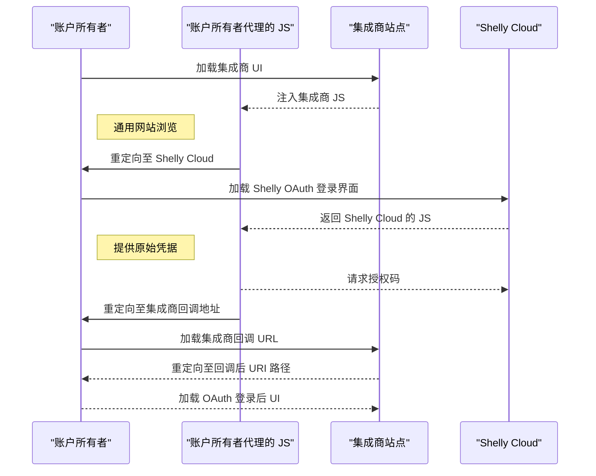

# 实时事件

除了通过 HTTP 命令控制设备外，还可以使用 OAuth 账户凭证建立 WebSocket 连接，以接收设备状态变化的实时事件。部分简单的设备控制命令也可以通过该接口发出。此 API 为集成商提供了一种简便方式，用于监控与单个 Shelly Cloud 账户关联的设备状态。

> **注意：** 本功能尚在开发中。最终版本文档中某些 URL 可能会发生变更。

## 适用场景与实现示例

该 API 适用于第三方集成商提供的用户级服务集成，或 DIY 爱好者进行复杂自动化脚本实验。**不适用于**需要监控多个用户账户设备状态事件的云到云集成场景。如果你的服务需要从单一接入点维护多个实时事件 WebSocket 连接，请强烈考虑使用以云为中心的 [集成商 API](/docs/integrator-api)。

一个可用的 Node.js/TypeScript 示例代码可在以下地址获取：[https://github.com/ALLTERCO/ushelly](https://github.com/ALLTERCO/ushelly)

### 集成商端预期架构

```
Shelly Cloud
    ↓
安全本地数据库
    ↓
WebSocket 实时状态更新
    ↓
HTTP 控制请求
    ↓
OAuth 回调辅助工具
    ↓
访问令牌数据库
    ↓
OAuth 登录初始化
```

## OAuth 规范（依据 [RFC6749](https://datatracker.ietf.org/doc/html/rfc6749)）

此 API 使用 OAuth 2.0 进行授权。如需复习 OAuth 工作流程，可观看此 [6 分钟视频](https://www.youtube.com/watch?v=CPbvxxslDTU)。文档假定读者已熟悉 OAuth 概念。

使用 OAuth 时，必须向授权 API 提供 `client_id`：
- **DIY 爱好者**：使用 `shelly-diy` 作为客户端 ID。
- **第三方集成商**：请联系 [support@allterco.com](mailto:support@allterco.com)，获取专用客户端 ID 和匹配的回调 URL 正则表达式。

使用 `shelly-diy` 客户端 ID 获取的令牌 **可能受到速率限制**。

## OAuth 详细信息（开发中）

### 触发登录流程

账户所有者最安全的登录流程如下：



尽管技术上可以在集成商服务器端或客户端 JavaScript 中完全处理原始凭据和授权码生成，但我们强烈建议不要这样做。账户所有者可能不愿将他们的凭据信任给非 `shelly.cloud` 域名的第三方。

当前 OAuth 授权端点为：  
`https://my.shelly.cloud/oauth_login.html`

重定向用户时，请包含以下查询参数：
- `client_id`：你的分配客户端 ID（例如 DIY 使用 `shelly-diy`）。
- `state`：附加到回调 URL 的状态令牌。**不进行 URL 编码**，因此如果值中包含 `&`，请使用双重 URL 编码或其他安全编码方式。
- `redirect_uri`：必须与你 `client_id` 预配置的正则表达式匹配。

### 获取授权码

成功授权后，浏览器将被重定向至你配置的回调 URL，并附带以下 GET 参数：
- `state`：与原始请求匹配。
- `code`：用于获取访问令牌的授权码。

### 理解授权码与访问令牌

Shelly Cloud 发放的所有令牌均为 JWT 格式。它们由密钥签名，但可使用任意标准 JWT 库（如 [jwt.io](https://jwt.io/libraries)）进行解码。

也可手动解码：
1. 将令牌按 `.` 分割。
2. 取中间部分。
3. 进行 Base64 解码。

解码后的 JSON 对象包含重要字段，例如：
- `user_api_url`：用户的指定服务器主机。所有后续 HTTP 调用和 WebSocket 连接 **必须** 针对该主机。

### 获取访问令牌

要执行 HTTP API 调用或认证 WebSocket 连接，你需要一个访问令牌——即用户同意的限时表示。

调用以下端点：
```
POST https://<shelly_server>/oauth/auth
```

传入以下参数：
- `client_id`：你的客户端 ID（测试时可用 `shelly-diy`）
- `grant_type`：必须为 `code`
- `code`：之前获取的 URL 编码授权码

成功响应为包含以下内容的 JSON 对象：
```json
{
  "access_token": "your_jwt_access_token",
  "expires_in": 3600
}
```

访问令牌为带有内置过期时间的 JWT。一旦过期，服务器将拒绝所有请求。你必须在令牌过期前刷新。

---

## 常见 API 注意事项

### 理解设备 ID

Shelly Cloud 各组件对设备 ID 的表示方式存在不一致：
- **面向用户界面** 使用十六进制格式。
- **设备端系统** 更偏好十进制字符串格式。
- 部分设备（BLE、Z-Wave）使用仅字符串形式的 ID，以 `X` 开头，无法与十六进制互转。

API 中混合使用这两种表示方式。关键点如下：
- 十六进制 ID 必须零填充至 6 或 12 位。
- 比较十六进制 ID 时，应统一大小写（全大写或全小写）。
- 在 JSON 负载中，始终将设备 ID 视为字符串。

转换方法：
- **十进制 → 十六进制**：使用 [shelly_types.ts](https://github.com/ALLTERCO/ushelly/blob/main/src/shelly_types.ts) 中的 `shelly_devid_hex()` 函数。
- **十六进制 → 十进制**：JavaScript 中使用 `String(parseInt(hexid, 16))`。

### 理解设备代际

Shelly 设备主要有两个主要代际：
- [Gen1](https://shelly-api-docs.shelly.cloud/gen1/#shelly-family-overview)
- [Gen2](/gen2)

同一代设备共享相似的数据结构，但 Gen1 与 Gen2 之间存在显著差异。代码库通常通过独立模块处理，共享逻辑极少。

通过 `gen` 字段识别代际：
- Gen1：`"gen": "G1"`
- Gen2：`"gen": "G2"`
- BLE：`"gen": "GBLE"`
- 虚拟设备：可能报告非标准值。

其他代际（如 Z-Wave）也存在，应在代码中尽早过滤掉。

---

## HTTP API

Shelly Cloud 暴露了多个 HTTP 端点，但由于持续演进，完整文档有意省略。以下是支持第三方集成在账户级别运行所需的基本集合。

> **授权**  
所有 HTTP API 调用必须包含：
```
Authorization: Bearer <ACCESS_TOKEN>
```

> **解析 API 结果**

大多数响应遵循以下结构：

**成功时：**
```json
{
  "isok": true,
  "data": { ... }
}
```

**出错时：**
```json
{
  "isok": false,
  "errors": [ "错误信息" ]
}
```

### 获取所拥有的设备当前/最新状态列表

> `GET /device/all_status?show_info=true&no_shared=true`

返回设备状态在 `data.devices_status` 中，键为设备 ID，值包含状态数据和元数据。

示例响应：
```json
{
  "isok": true,
  "data": {
    "devices_status": {
      "dc4f2276846a": {
        // ... 状态字段 ...
        "_dev_info": {
          "id": "dc4f2276846a",
          "gen": "G1",
          "code": "SHSW-1",
          "online": false
        }
      },
      "84cca87c0144": {
        // ... 状态字段 ...
        "_dev_info": {
          "id": "84cca87c0144",
          "gen": "G2",
          "code": "SPSW-001PE16EU",
          "online": true
        }
      },
      "1643370677417": {
        // ... 状态字段 ...
        "_dev_info": {
          "gen": "V1",
          "id": 1643370677417,
          "code": "THERMOSTAT",
          "online": false
        }
      }
    }
  }
}
```

**关键说明：**
- 所有状态均包含 `_dev_info` 元数据：`gen`、`code` 和 `id`。
- 不要假设非 G1 设备就是 G2 —— 还存在其他类型（如 V1、GBLE）。
- `devices_status` 中的键不一致且可能变化（尤其是虚拟恒温器）。**不应依赖这些键。**
- 对于 Gen1/G2 设备，`_dev_info` 中的 `id` 为十六进制；其他类型可能不同。
- `online` 表示云端可见性：
  - `true`：设备在线，可发送命令。
  - `false`：云端拒绝处理命令；不会进行命令缓存。
- 电池供电设备可能显示在线，但实际离线。
- 忽略 `data` 中除 `devices_status` 外的所有顶层字段。

---

## WebSocket API

建立 WebSocket 连接以接收实时设备事件：

```
wss://<shelly_cloud_server>:6113/shelly/wss/hk_sock?t=<ACCESS_TOKEN>
```

服务器发送的所有消息均为 JSON 编码。服务器消息 **应** 包含 `event` 键以标识事件类型。你的代码必须能优雅地忽略未知格式或事件类型。

### 事件：`Shelly:StatusOnChange`

当设备报告状态变更时发送。

```json
{
  "event": "Shelly:StatusOnChange",
  "device": {
    "id": "string",
    "code": "string",
    "gen": "string"
  },
  "status": { ... }
}
```

- `device`：标识源设备。
- `status`：包含更新后的设备状态。

### 事件：`Shelly:Online`

当设备的在线状态发生变化时发送。

```json
{
  "event": "Shelly:Online",
  "device": {
    "id": "string",
    "code": "string",
    "gen": "string"
  },
  "online": 1
}
```

- `online`：`1` = 在线，`0` = 离线。

### 事件：`Shelly:CommandResponse`

当发送至设备的命令被处理完毕后接收。

```json
{
  "event": "Shelly:CommandResponse",
  "deviceId": "string",
  "trid": 12345,
  "data": { ... }
}
```

- `trid`：事务 ID，与原始请求匹配。
- `deviceId`：目标设备。
- `data`：来自设备的响应负载，或错误码。

### 请求：`Shelly:CommandRequest`

客户端可通过此结构通过 WebSocket 发送控制命令：

```json
{
  "event": "Shelly:CommandRequest",
  "trid": 12345,
  "deviceId": "string",
  "data": {
    "cmd": "string",
    "params": { ... }
  }
}
```

- `trid`：唯一事务 ID。使用原子计数器并循环（例如递增至最大值后重置为 0）。
- `deviceId`：目标设备 ID。
- `data.cmd`：命令类型。
- `data.params`：命令特定参数。

---

### 已实现的命令请求

#### **relay**

更改继电器的状态。

```json
{
  "cmd": "relay",
  "params": {
    "turn": "on|off|toggle",
    "id": 0
  }
}
```

- `turn`：`on`、`off` 或 `toggle`。
- `id`：继电器通道索引（从 0 开始）。即使单通道继电器也必需。

#### **light**

控制灯光控制器。

```json
{
  "cmd": "light",
  "params": {
    "id": 0,
    "turn": "on|off|toggle",
    "mode": "string",
    "timeout": 30,
    "red": 255,
    "green": 0,
    "blue": 0,
    "white": 100,
    "gain": 100,
    "brightness": 100,
    "effect": 3,
    "temp": 3000
  }
}
```

- 除 `id` 外所有参数均可选。
- `id`：通道索引（基于 0），即使单通道设备也必需。
- `turn`：`on`、`off` 或 `toggle`。
- `gain`、`brightness`：0–100（100 = 全功率）。
- `effect`：0–6（模型特定）。
- 颜色：0–255（RGB 色彩空间）。
- `temp`：色温，单位开尔文（Kelvin）。

> ✅ 请参考设备本地控制文档以了解支持的功能。

#### **roller**

启动或停止卷帘/遮阳板。

```json
{
  "cmd": "roller",
  "params": {
    "go": "up|down|stop",
    "duration": 30,
    "id": 0
  }
}
```

- `go`：`up`、`down` 或 `stop`。
- `id`：卷帘/遮阳板通道（基于 0），必需。
- `duration`：可选（单位秒），仅对 `up` 和 `down` 有效。

#### **roller_to_pos**

将卷帘/遮阳板移动到特定位置。

```json
{
  "cmd": "roller_to_pos",
  "params": {
    "id": 0,
    "pos": 75,
    "rel": 0,
    "slat_pos": 50,
    "slat_rel": 0
  }
}
```

**对于 Gen1 和 Gen2+ 设备：**
- 设备必须完成校准，此命令才被接受。
- `id`：通道索引（基于 0），必需。
- `pos`：位置百分比（0–100）。
- `rel`：相对移动百分比（`-100` 到 `100`）。不能与 `pos` 同时使用。
- `slat_pos`：百叶窗位置（如支持），0–100。
- `slat_rel`：相对百叶窗移动（如支持），`-100` 到 `100`。不能与 `slat_pos` 同时使用。