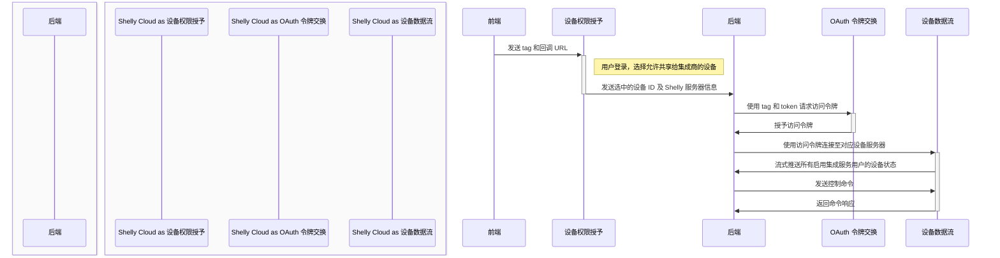

# 快速入门

## 简介

我们开发了一套云端到云端的 API，用于集成、控制和收集来自我们设备的遥测数据。本文档旨在帮助第三方集成商监控和控制连接至我们云系统的 Shelly 设备。该 API 支持将多个 Shelly 账户的状态数据集中流式传输至单一接入点，便于数据采集。同时，也支持基础的设备控制功能。

要开始使用，请先创建一个集成商账户，并配置相应的通信端点。如需账户创建及许可证申请，请联系 [support@shelly.cloud](mailto:support@shelly.cloud) 或填写此 [表单](https://forms.office.com/e/KDxYr4K3vF)。个人用户不提供许可证。

希望使用集成商服务的设备所有者，需登录其 Shelly Cloud 账户，并授权将指定设备共享给集成商。该授权可随时撤销。

如果您更关注 **以 Shelly 账户为中心** 的使用场景，建议使用 [实时事件 (Real Time Events)](/cloud-control-api/real-time-events) API，它提供类似功能，通过 Shelly 账户所有者的 OAuth 凭证进行身份验证。

若您希望 **完全脱离 Shelly Cloud**，且正在使用 Gen 2 设备，推荐使用 [Shelly Fleet Management](https://github.com/ALLTERCO/fleet-management)。

### 交互图示



### 集成商端预期架构

```
Shelly Cloud
├── 实时事件处理服务（每个 Shelly 服务器一个 WebSocket）
├── 数据库
├── 应用后端
│   ├── 用户授权（添加/移除跟踪设备）
│   ├── 控制
│   ├── 状态
│   └── 统计
└── 应用程序
    ├── 用户认证
    └── Shelly 用户授权
```

### 获取集成商账户

请通过 [support@allterco.com](mailto:support@allterco.com) 联系我们，或填写此 [表单](https://forms.office.com/e/KDxYr4K3vF)。您将获得两个唯一标识符：`tag` 和 `token`。

### 设备权限授予

用户通过访问以下链接，授予集成商对其设备的监控权限：

```
https://my.shelly.cloud/integrator.html?itg=<TAG>&cb=<URL>
```

集成商必须确保 `cb` 参数中提供的 `<URL>` 始终可访问。这使得集成商后端能够接收关于新设备监控和新 Shelly Cloud 服务器连接的通知。详情请参见 [用户授权 / 权限授予](/integrator-api/users)。

### 请求访问令牌

使用提供的集成商 `tag` 和 `token` 获取 JWT（访问令牌，有效期 24 小时），该令牌是建立 WSS 连接及其他 API 操作所必需的。连接可保持长期活跃。

```bash
curl -X POST 'https://api.shelly.cloud/integrator/get_access_token' \
  --header 'Content-Type: application/x-www-form-urlencoded' \
  --data-urlencode 'itg=<INTEGRATOR_TAG>' \
  --data-urlencode 'token=<INTEGRATOR_TOKEN>'
```

响应：
```json
{
  "isok": true,
  "data": "<JWT>"
}
```

### WebSocket 连接

建立 WebSocket 连接并使用 JWT 进行认证：

```
wss://<HOST>:6113/shelly/wss/hk_sock?t=<JWT>
```

Shelly Cloud 存在多个服务器实例，每位用户及其设备始终连接至同一台服务器。对某一台 Shelly 服务器建立的单个 WSS 连接，即可接收该服务器上所有已启用集成服务的设备数据。若集成商有客户分布在多个服务器，则可能需要建立多个开放的 socket 连接——每台服务器一个。每台服务器仅允许一个活跃连接。

WSS 连接所需的正确服务器主机（`<HOST>`）将在设备权限授予阶段通过 `host` 参数提供。集成商必须为每个托管活跃用户的服务器维持至少一个打开的连接。

> **注意：** 此 API 将数据交付至集成商基础设施内的单一位置。如果集成商需要在多个服务器或数据中心之间使用这些数据，则内部数据分发的责任由集成商自行承担。