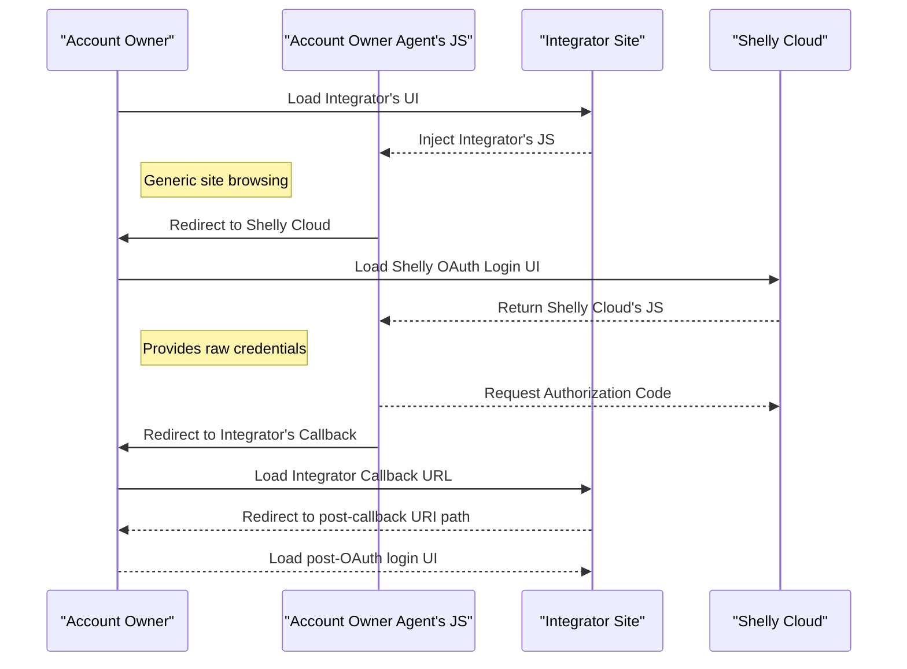

# Real Time Events

Besides HTTP commands to control devices, a WebSocket connection can be established via OAuth account credentials to receive real-time events about device status changes. Some simple device control commands can also be issued. This API provides a straightforward way for integrators to monitor device statuses associated with a single Shelly Cloud account.

> **Note:** This is work in progress. Some URLs may change in the final version of this documentation.

## Intended Use and Implementation Example

This API is intended for third-party integrators providing user-level integration with their services, or for DIY enthusiasts experimenting with complex automation scripting. It is **not** intended for cloud-to-cloud integrators who need to monitor multiple user accounts for device status events. If your use case involves maintaining multiple Real-Time Events WebSocket connections from a single service point, you should strongly consider using the cloud-centric [Integrator API](/integrator-api/).

A working Node.js/TypeScript example for consuming this API is available at: [https://github.com/ALLTERCO/ushelly](https://github.com/ALLTERCO/ushelly)

### Expected Architecture on the Integrator Side

```
Shelly Cloud
    ↓
Secure Local DB
    ↓
WebSocket for live status updates
    ↓
HTTP Control Requests
    ↓
OAuth Callback Helper
    ↓
Access Token DB
    ↓
OAuth Login Initiation
```

## OAuth as per [RFC6749](https://datatracker.ietf.org/doc/html/rfc6749)

This API uses OAuth 2.0 for authorization. For a refresher on the OAuth workflow, see this [6-minute video](https://www.youtube.com/watch?v=CPbvxxslDTU). The documentation assumes familiarity with OAuth concepts.

To use OAuth, a `client_id` must be provided to the authorization APIs.  
- **DIY Enthusiasts**: Use `shelly-diy` as the client ID.  
- **Third-Party Integrators**: Contact us at [support@allterco.com](mailto:support@allterco.com) to obtain a dedicated client ID and matching callback URL regex.

Tokens obtained using the `shelly-diy` client ID **may be subject to rate restrictions**.

## OAuth Details (Work in Progress)

### Triggering the Login Process

The most secure login flow for an account owner follows this sequence:



While it's technically possible to handle raw credentials and authorization code generation entirely on the integrator’s server-side or client-side JavaScript, we strongly advise against it. Account owners may be hesitant to trust their credentials to a domain other than `shelly.cloud`.

The current OAuth authorization endpoint is:  
`https://my.shelly.cloud/oauth_login.html`

When redirecting the user, include the following query parameters:
- `client_id`: Your assigned client ID (e.g., `shelly-diy` for DIY).
- `state`: A state token appended to the callback URL. **No URL encoding is applied**, so if your value contains `&`, use double URL encoding or another safe encoding method.
- `redirect_uri`: Must match the regular expression pre-configured for your `client_id`.

### Obtaining the Authorization Code

Upon successful authorization, the browser is redirected to your configured callback URL with these GET parameters:
- `state`: Matches the original request.
- `code`: The authorization code used to obtain an access token.

### Understanding the Authorization Code and Access Token

All tokens issued by Shelly Cloud are JWTs. They are signed with a secret key but can be decoded using any standard JWT library (e.g., [jwt.io](https://jwt.io/libraries)).

Alternatively, you can decode manually:
1. Split the token by `.`
2. Take the middle part
3. Base64-decode it

The resulting JSON object includes important fields such as:
- `user_api_url`: The designated server host for the user. All subsequent HTTP calls and WebSocket connections **must** target this host.

### Obtaining the Access Token

To perform HTTP API calls or authenticate a WebSocket connection, you need an access token — a time-limited representation of the user’s consent.

Call the following endpoint:
```
POST https://<shelly_server>/oauth/auth
```

With the following parameters:
- `client_id`: Your client ID (or `shelly-diy` for testing)
- `grant_type`: Must be `code`
- `code`: The URL-encoded authorization code obtained earlier

On success, the response is a JSON object containing:
```json
{
  "access_token": "your_jwt_access_token",
  "expires_in": 3600
}
```

The access token is a JWT with built-in expiration. If expired, the server will reject all requests. You must refresh the token before expiry.

---

## Common API Considerations

### Understanding Device IDs

There is inconsistency in how device IDs are represented across Shelly Cloud components:
- **User-facing interfaces** use hexadecimal format.
- **Device-facing systems** prefer decimal string format.
- Some devices (BLE, ZWave) use string-only IDs starting with `X`, which cannot be converted to/from hex.

APIs mix both representations. Key points:
- Hexadecimal IDs must be zero-padded to 6 or 12 characters.
- When comparing hex IDs, normalize case (uppercase or lowercase).
- Always treat device IDs as strings in JSON payloads.

For conversion:
- **Decimal → Hex**: Use `shelly_devid_hex()` function from [shelly_types.ts](https://github.com/ALLTERCO/ushelly/blob/main/src/shelly_types.ts).
- **Hex → Decimal**: Use `String(parseInt(hexid, 16))` in JavaScript.

### Understanding Device Generations

There are two main generations of Shelly devices:
- [Gen1](https://shelly-api-docs.shelly.cloud/gen1/#shelly-family-overview)
- [Gen2](/gen2)

Devices within the same generation share similar data structures, but significant differences exist between Gen1 and Gen2. Codebases often handle them via separate modules with minimal shared logic.

Identify generation via the `gen` field:
- Gen1: `"gen": "G1"`
- Gen2: `"gen": "G2"`
- BLE: `"gen": "GBLE"`
- Virtual devices: May report non-standard values.

Other generations (e.g., Z-Wave) exist and should be filtered out early in your code.

---

## HTTP API

Shelly Cloud exposes many HTTP endpoints, but due to ongoing evolution, full documentation is intentionally omitted. Below is the minimal set required for functional third-party integrations at the account level.

> **Authorization**  
All HTTP API calls must include:
```
Authorization: Bearer <ACCESS_TOKEN>
```

> **Interpreting API Results**

Most responses follow this structure:

**On Success:**
```json
{
  "isok": true,
  "data": { ... }
}
```

**On Error:**
```json
{
  "isok": false,
  "errors": [ "error message" ]
}
```

### List of Current/Last Known Statuses of Owned Devices

> `GET /device/all_status?show_info=true&no_shared=true`

Returns device statuses in `data.devices_status`, where keys are device IDs and values contain status data and metadata.

Example response:
```json
{
  "isok": true,
  "data": {
    "devices_status": {
      "dc4f2276846a": {
        // ... status fields ...
        "_dev_info": {
          "id": "dc4f2276846a",
          "gen": "G1",
          "code": "SHSW-1",
          "online": false
        }
      },
      "84cca87c0144": {
        // ... status fields ...
        "_dev_info": {
          "id": "84cca87c0144",
          "gen": "G2",
          "code": "SPSW-001PE16EU",
          "online": true
        }
      },
      "1643370677417": {
        // ... status fields ...
        "_dev_info": {
          "gen": "V1",
          "id": 1643370677417,
          "code": "THERMOSTAT",
          "online": false
        }
      }
    }
  }
}
```

**Key Notes:**
- All statuses include `_dev_info` metadata: `gen`, `code`, and `id`.
- Do not assume that non-G1 devices are G2 — other types exist (e.g., V1, GBLE).
- The keys in `devices_status` are inconsistent and may change (especially for virtual thermostats). **Do not rely on them.**
- For Gen1/G2 devices, `id` in `_dev_info` is hexadecimal. For others, it may differ.
- `online` indicates cloud visibility:
  - `true`: Device is online and commands can be sent.
  - `false`: Cloud refuses to process commands; no command buffering occurs.
- Battery-powered devices may appear online while physically offline.
- Ignore all top-level fields in `data` except `devices_status`.

---

## WebSocket API

Establish a WebSocket connection to receive real-time device events:

```
wss://<shelly_cloud_server>:6113/shelly/wss/hk_sock?t=<ACCESS_TOKEN>
```

All messages from the server are JSON-encoded. Messages from the server **should** include an `event` key identifying the event type. Your code must gracefully ignore unknown formats or event types.

### Event: `Shelly:StatusOnChange`

Sent when a device reports a status change.

```json
{
  "event": "Shelly:StatusOnChange",
  "device": {
    "id": "string",
    "code": "string",
    "gen": "string"
  },
  "status": { ... }
}
```

- `device`: Identifies the source device.
- `status`: Contains the updated device status.

### Event: `Shelly:Online`

Sent when a device’s online status changes.

```json
{
  "event": "Shelly:Online",
  "device": {
    "id": "string",
    "code": "string",
    "gen": "string"
  },
  "online": 1
}
```

- `online`: `1` = online, `0` = offline.

### Event: `Shelly:CommandResponse`

Received when a command sent to a device is resolved.

```json
{
  "event": "Shelly:CommandResponse",
  "deviceId": "string",
  "trid": 12345,
  "data": { ... }
}
```

- `trid`: Transaction ID matching the original request.
- `deviceId`: Target device.
- `data`: Response payload from the device, or an error code.

### Request: `Shelly:CommandRequest`

Clients can send control commands via WebSocket using this structure:

```json
{
  "event": "Shelly:CommandRequest",
  "trid": 12345,
  "deviceId": "string",
  "data": {
    "cmd": "string",
    "params": { ... }
  }
}
```

- `trid`: Unique transaction ID. Use an atomic counter that wraps around (e.g., incrementing until max, then reset to 0).
- `deviceId`: Target device ID.
- `data.cmd`: Command type.
- `data.params`: Command-specific parameters.

---

### Implemented Command Requests

#### **relay**

Changes the state of a relay.

```json
{
  "cmd": "relay",
  "params": {
    "turn": "on|off|toggle",
    "id": 0
  }
}
```

- `turn`: `on`, `off`, or `toggle`.
- `id`: Relay channel index (starts at 0). Required even for single-channel relays.

#### **light**

Controls a light controller.

```json
{
  "cmd": "light",
  "params": {
    "id": 0,
    "turn": "on|off|toggle",
    "mode": "string",
    "timeout": 30,
    "red": 255,
    "green": 0,
    "blue": 0,
    "white": 100,
    "gain": 100,
    "brightness": 100,
    "effect": 3,
    "temp": 3000
  }
}
```

- All parameters except `id` are optional.
- `id`: Channel index (0-based), required even for single-channel devices.
- `turn`: `on`, `off`, or `toggle`.
- `gain`, `brightness`: 0–100 (100 = full power).
- `effect`: 0–6 (model-specific).
- Colors: 0–255 (RGB color space).
- `temp`: Color temperature in Kelvin.

> ✅ Refer to the device’s local control documentation for supported features.

#### **roller**

Starts or stops a roller/cover.

```json
{
  "cmd": "roller",
  "params": {
    "go": "up|down|stop",
    "duration": 30,
    "id": 0
  }
}
```

- `go`: `up`, `down`, or `stop`.
- `id`: Roller/cover channel (0-based), required.
- `duration`: Optional (in seconds), only valid for `up` and `down`.

#### **roller_to_pos**

Moves a roller/cover to a specific position.

```json
{
  "cmd": "roller_to_pos",
  "params": {
    "id": 0,
    "pos": 75,
    "rel": 0,
    "slat_pos": 50,
    "slat_rel": 0
  }
}
```

**For Gen1 and Gen2+ devices:**
- Device must be calibrated for this command to be accepted.
- `id`: Channel index (0-based), required.
- `pos`: Position in percent (0–100).
- `rel`: Relative movement in % (`-100` to `100`). Cannot be used with `pos`.
- `slat_pos`: Slat position (if supported), 0–100.
- `slat_rel`: Relative slat movement (if supported), `-100` to `100`. Cannot be used with `slat_pos`.