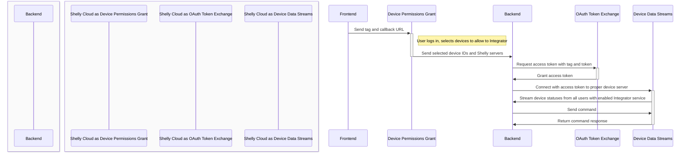

# Getting Started

## Introduction

We have developed a Cloud-to-Cloud API for integration, control, and telemetry collection from our devices. This documentation is intended for third-party integrators who wish to monitor and control Shelly devices connected to our cloud systems. It enables centralized streaming of status data from multiple Shelly accounts to a single point for data ingestion. Basic device control is also supported.

To get started, an integrator account must be created, including communication endpoints for the integrator. For account creation and license acquisition, contact us at [support@shelly.cloud](mailto:support@shelly.cloud) or fill out this [form](https://forms.office.com/e/KDxYr4K3vF). Licenses for personal use are not provided.

Device owners wishing to use an integrator’s services must log into their Shelly Cloud account and grant consent to share a selected set of devices with the integrator. They can revoke this consent at any time.

If your use case is more **Shelly account-centric**, consider using the [Real Time Events](/cloud-control-api/real-time-events) API, which offers similar functionality with OAuth-based authentication via the Shelly account owner’s credentials.

If you want to be **independent of Shelly Cloud** and are using Gen 2 devices, we recommend checking out [Shelly Fleet Management](https://github.com/ALLTERCO/fleet-management).

### Interaction Diagram



### Expected Architecture on the Integrator Side

```
Shelly Cloud
├── Realtime Event Handling Service (1 WebSocket per Shelly server)
├── DATABASE
├── Application Backend
│   ├── User Consent (Add/Remove device for tracking)
│   ├── Control
│   ├── Status
│   └── Statistics
└── APP
    ├── User Authentication
    └── Shelly User Consent
```

### Acquire Integrator Account

Contact us at [support@allterco.com](mailto:support@allterco.com) or complete this [form](https://forms.office.com/e/KDxYr4K3vF). You will receive two unique identifiers: `tag` and `token`.

### Device Permission Grant

Users grant the integrator permission to monitor their devices by visiting:

```
https://my.shelly.cloud/integrator.html?itg=<TAG>&cb=<URL>
```

The integrator must ensure the `<URL>` provided with the `cb` parameter remains accessible at all times. This allows the integrator’s backend to receive notifications about new devices to monitor and new Shelly Cloud servers to connect to. See [User Consent / Permissions Grant](/integrator-api/users) for details.

### Request Access Token

Use the provided integrator `tag` and `token` to obtain a JWT (access token valid for 24 hours), which is required for establishing WSS connections and other API operations. The connection can remain active indefinitely.

```bash
curl -X POST 'https://api.shelly.cloud/integrator/get_access_token' \
  --header 'Content-Type: application/x-www-form-urlencoded' \
  --data-urlencode 'itg=<INTEGRATOR_TAG>' \
  --data-urlencode 'token=<INTEGRATOR_TOKEN>'
```

Response:
```json
{
  "isok": true,
  "data": "<JWT>"
}
```

### Web Socket Connection

Establish a WebSocket connection and authenticate using the JWT:

```
wss://<HOST>:6113/shelly/wss/hk_sock?t=<JWT>
```

There are multiple Shelly Cloud servers, and each user and their devices always connect to the same server. A single WSS connection to a Shelly server receives data from all devices with enabled integration on that server. Multiple open sockets may be required—one per server where the integrator has active customers. Only one active connection per server is allowed.

The correct server host for the WSS connection will be provided during the device permission grant via the `host` parameter. The integrator must maintain at least one open connection to each server hosting active users.

> **Note:** This API delivers data to a single location within the integrator’s infrastructure. If the integrator needs to use this data across multiple servers or data centers, it is the integrator’s responsibility to distribute the data internally.