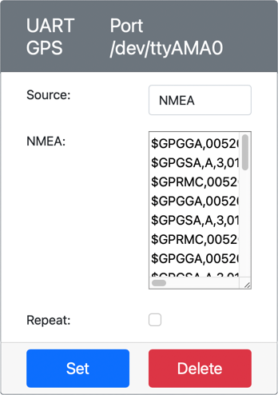
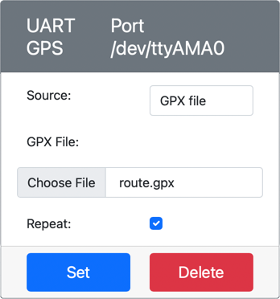

<!--
CO_OP_TRANSLATOR_METADATA:
{
  "original_hash": "64f18a8f8aaa1fef5e7320e0992d8b3a",
  "translation_date": "2025-08-25T00:45:25+00:00",
  "source_file": "3-transport/lessons/1-location-tracking/virtual-device-gps-sensor.md",
  "language_code": "zh"
}
-->
# 读取 GPS 数据 - 虚拟物联网硬件

在本课程的这一部分，你将为虚拟物联网设备添加一个 GPS 传感器，并从中读取数据。

## 虚拟硬件

虚拟物联网设备将使用一个通过串口 UART 访问的模拟 GPS 传感器。

物理 GPS 传感器通常配备天线，用于接收来自 GPS 卫星的无线电波，并将 GPS 信号转换为 GPS 数据。虚拟版本通过以下方式进行模拟：你可以设置纬度和经度、发送原始 NMEA 语句，或者上传包含多个位置的 GPX 文件，这些位置将按顺序返回。

> 🎓 NMEA 语句将在本课程后续部分介绍

### 将传感器添加到 CounterFit

要使用虚拟 GPS 传感器，你需要将其添加到 CounterFit 应用中。

#### 任务 - 将传感器添加到 CounterFit

将 GPS 传感器添加到 CounterFit 应用。

1. 在你的电脑上创建一个名为 `gps-sensor` 的文件夹，并在其中创建一个新的 Python 应用，包含一个名为 `app.py` 的文件和一个 Python 虚拟环境，然后添加 CounterFit 的 pip 包。

    > ⚠️ 如果需要，可以参考[课程 1 中关于创建和设置 CounterFit Python 项目的说明](../../../1-getting-started/lessons/1-introduction-to-iot/virtual-device.md)。

1. 安装一个额外的 Pip 包，用于安装一个 CounterFit shim，可以通过串口与基于 UART 的传感器通信。确保在激活虚拟环境的终端中安装此包。

    ```sh
    pip install counterfit-shims-serial
    ```

1. 确保 CounterFit 网页应用正在运行。

1. 创建一个 GPS 传感器：

    1. 在 *Sensors* 面板的 *Create sensor* 框中，点击 *Sensor type* 下拉框并选择 *UART GPS*。

    1. 将 *Port* 保持为 */dev/ttyAMA0*。

    1. 点击 **Add** 按钮，在端口 `/dev/ttyAMA0` 上创建 GPS 传感器。

    

    GPS 传感器将被创建并显示在传感器列表中。

    

## 编程 GPS 传感器

现在可以为虚拟物联网设备编程以使用虚拟 GPS 传感器。

### 任务 - 编程 GPS 传感器

编写 GPS 传感器应用程序。

1. 确保 `gps-sensor` 应用已在 VS Code 中打开。

1. 打开 `app.py` 文件。

1. 在 `app.py` 文件顶部添加以下代码，将应用连接到 CounterFit：

    ```python
    from counterfit_connection import CounterFitConnection
    CounterFitConnection.init('127.0.0.1', 5000)
    ```

1. 在此代码下方添加以下代码，导入一些所需的库，包括用于 CounterFit 串口的库：

    ```python
    import time
    import counterfit_shims_serial
    
    serial = counterfit_shims_serial.Serial('/dev/ttyAMA0')
    ```

    此代码从 `counterfit_shims_serial` Pip 包中导入 `serial` 模块。然后连接到 `/dev/ttyAMA0` 串口——这是虚拟 GPS 传感器用于其 UART 端口的地址。

1. 在此代码下方添加以下代码，从串口读取数据并将值打印到控制台：

    ```python
    def print_gps_data(line):
        print(line.rstrip())
    
    while True:
        line = serial.readline().decode('utf-8')
    
        while len(line) > 0:
            print_gps_data(line)
            line = serial.readline().decode('utf-8')
    
        time.sleep(1)
    ```

    定义了一个名为 `print_gps_data` 的函数，用于将传入的行打印到控制台。

    接下来，代码进入一个无限循环，在每次循环中尽可能多地从串口读取文本行。它为每一行调用 `print_gps_data` 函数。

    读取完所有数据后，循环会休眠 1 秒，然后再次尝试。

1. 运行此代码，确保使用与运行 CounterFit 应用不同的终端，以便 CounterFit 应用保持运行状态。

1. 在 CounterFit 应用中更改 GPS 传感器的值。你可以通过以下方式之一进行更改：

    * 将 **Source** 设置为 `Lat/Lon`，并设置明确的纬度、经度以及用于获取 GPS 定位的卫星数量。此值将仅发送一次，因此勾选 **Repeat** 复选框以使数据每秒重复发送。

      

    * 将 **Source** 设置为 `NMEA`，并在文本框中添加一些 NMEA 语句。所有这些值将被发送，每个新的 GGA（位置固定）语句之间有 1 秒的延迟。

      

      你可以使用类似 [nmeagen.org](https://www.nmeagen.org) 的工具通过在地图上绘制来生成这些语句。这些值将仅发送一次，因此勾选 **Repeat** 复选框以使数据在全部发送后每秒重复一次。

    * 将 **Source** 设置为 GPX 文件，并上传一个包含轨迹位置的 GPX 文件。你可以从许多流行的地图和徒步网站（如 [AllTrails](https://www.alltrails.com/)）下载 GPX 文件。这些文件包含多个 GPS 位置作为轨迹，GPS 传感器将以 1 秒间隔返回每个新位置。

      

      这些值将仅发送一次，因此勾选 **Repeat** 复选框以使数据在全部发送后每秒重复一次。

    配置 GPS 设置后，点击 **Set** 按钮将这些值提交到传感器。

1. 你将看到来自 GPS 传感器的原始输出，类似如下：

    ```text
    $GNGGA,020604.001,4738.538654,N,12208.341758,W,1,3,,164.7,M,-17.1,M,,*67
    $GNGGA,020604.001,4738.538654,N,12208.341758,W,1,3,,164.7,M,-17.1,M,,*67
    ```

> 💁 你可以在 [code-gps/virtual-device](../../../../../3-transport/lessons/1-location-tracking/code-gps/virtual-device) 文件夹中找到此代码。

😀 恭喜！你的 GPS 传感器程序运行成功！
