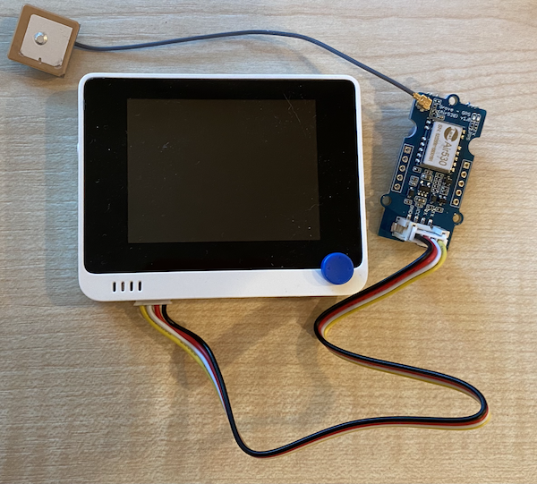

<!--
CO_OP_TRANSLATOR_METADATA:
{
  "original_hash": "da6ae0a795cf06be33d23ca5b8493fc8",
  "translation_date": "2025-08-25T00:44:02+00:00",
  "source_file": "3-transport/lessons/1-location-tracking/wio-terminal-gps-sensor.md",
  "language_code": "zh"
}
-->
# 读取 GPS 数据 - Wio Terminal

在本课的这一部分中，您将为 Wio Terminal 添加一个 GPS 传感器，并读取其数据。

## 硬件

Wio Terminal 需要一个 GPS 传感器。

您将使用的传感器是 [Grove GPS Air530 传感器](https://www.seeedstudio.com/Grove-GPS-Air530-p-4584.html)。该传感器可以连接到多个 GPS 系统，以实现快速、准确的定位。传感器由两部分组成——传感器的核心电子部分，以及通过一根细线连接的外部天线，用于接收来自卫星的无线电波。

这是一个 UART 传感器，因此通过 UART 发送 GPS 数据。

### 连接 GPS 传感器

Grove GPS 传感器可以连接到 Wio Terminal。

#### 任务 - 连接 GPS 传感器

连接 GPS 传感器。


1. 将 Grove 电缆的一端插入 GPS 传感器上的插座。电缆只能以一种方向插入。

1. 在 Wio Terminal 未连接到计算机或其他电源的情况下，将 Grove 电缆的另一端连接到 Wio Terminal 屏幕左侧的 Grove 插座。这是靠近电源按钮的插座。

    

1. 将 GPS 传感器放置在附带天线可以看到天空的位置——理想情况下靠近窗户或在室外。天线周围没有障碍物时，更容易获得清晰的信号。

1. 现在可以将 Wio Terminal 连接到您的计算机。

1. GPS 传感器有两个 LED 指示灯——蓝色 LED 在传输数据时闪烁，绿色 LED 在接收到来自卫星的数据时每秒闪烁一次。确保在 Wio Terminal 通电时蓝色 LED 闪烁。几分钟后，绿色 LED 会开始闪烁——如果没有，您可能需要重新调整天线的位置。

## 编程 GPS 传感器

现在可以为 Wio Terminal 编写程序，以使用连接的 GPS 传感器。

### 任务 - 编程 GPS 传感器

为设备编写程序。

1. 使用 PlatformIO 创建一个全新的 Wio Terminal 项目。将该项目命名为 `gps-sensor`。在 `setup` 函数中添加代码以配置串口。

1. 在 `main.cpp` 文件顶部添加以下 include 指令。这将包含一个头文件，其中包含用于配置左侧 Grove 端口为 UART 的函数。

    ```cpp
    #include <wiring_private.h>
    ```

1. 在此之后，添加以下代码行以声明一个与 UART 端口的串口连接：

    ```cpp
    static Uart Serial3(&sercom3, PIN_WIRE_SCL, PIN_WIRE_SDA, SERCOM_RX_PAD_1, UART_TX_PAD_0);
    ```

1. 您需要添加一些代码，将一些内部信号处理程序重定向到该串口。将以下代码添加到 `Serial3` 声明之后：

    ```cpp
    void SERCOM3_0_Handler()
    {
        Serial3.IrqHandler();
    }
    
    void SERCOM3_1_Handler()
    {
        Serial3.IrqHandler();
    }
    
    void SERCOM3_2_Handler()
    {
        Serial3.IrqHandler();
    }
    
    void SERCOM3_3_Handler()
    {
        Serial3.IrqHandler();
    }
    ```

1. 在 `setup` 函数中，在配置 `Serial` 端口的代码之后，使用以下代码配置 UART 串口：

    ```cpp
    Serial3.begin(9600);

    while (!Serial3)
        ; // Wait for Serial3 to be ready

    delay(1000);
    ```

1. 在 `setup` 函数中的上述代码之后，添加以下代码以将 Grove 引脚连接到串口：

    ```cpp
    pinPeripheral(PIN_WIRE_SCL, PIO_SERCOM_ALT);
    ```

1. 在 `loop` 函数之前，添加以下函数以将 GPS 数据发送到串口监视器：

    ```cpp
    void printGPSData()
    {
        Serial.println(Serial3.readStringUntil('\n'));
    }
    ```

1. 在 `loop` 函数中，添加以下代码以从 UART 串口读取数据并将输出打印到串口监视器：

    ```cpp
    while (Serial3.available() > 0)
    {
        printGPSData();
    }
    
    delay(1000);
    ```

    这段代码从 UART 串口读取数据。`readStringUntil` 函数会读取直到终止符（在本例中是换行符）为止的数据。这将读取整个 NMEA 语句（NMEA 语句以换行符结束）。只要可以从 UART 串口读取数据，就会读取数据并通过 `printGPSData` 函数发送到串口监视器。一旦无法读取更多数据，`loop` 会延迟 1 秒（1,000 毫秒）。

1. 构建并上传代码到 Wio Terminal。

1. 上传完成后，您可以使用串口监视器查看 GPS 数据。

    ```text
    > Executing task: platformio device monitor <
    
    --- Available filters and text transformations: colorize, debug, default, direct, hexlify, log2file, nocontrol, printable, send_on_enter, time
    --- More details at http://bit.ly/pio-monitor-filters
    --- Miniterm on /dev/cu.usbmodem1201  9600,8,N,1 ---
    --- Quit: Ctrl+C | Menu: Ctrl+T | Help: Ctrl+T followed by Ctrl+H ---
    $GNGGA,020604.001,4738.538654,N,12208.341758,W,1,3,,164.7,M,-17.1,M,,*67
    $GPGSA,A,1,,,,,,,,,,,,,,,*1E
    $BDGSA,A,1,,,,,,,,,,,,,,,*0F
    $GPGSV,1,1,00*79
    $BDGSV,1,1,00*68
    ```

> 💁 您可以在 [code-gps/wio-terminal](../../../../../3-transport/lessons/1-location-tracking/code-gps/wio-terminal) 文件夹中找到这段代码。

😀 恭喜！您的 GPS 传感器程序运行成功！
