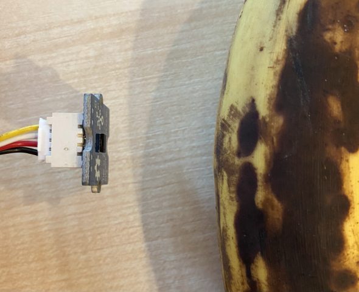

<!--
CO_OP_TRANSLATOR_METADATA:
{
  "original_hash": "288aebb0c59f7be1d2719b8f9660a313",
  "translation_date": "2025-08-24T21:54:32+00:00",
  "source_file": "4-manufacturing/lessons/4-trigger-fruit-detector/wio-terminal-proximity.md",
  "language_code": "zh"
}
-->
# 检测接近 - Wio Terminal

在本课的这一部分中，您将为 Wio Terminal 添加一个接近传感器，并读取其距离数据。

## 硬件

Wio Terminal 需要一个接近传感器。

您将使用的传感器是 [Grove 飞行时间距离传感器](https://www.seeedstudio.com/Grove-Time-of-Flight-Distance-Sensor-VL53L0X.html)。该传感器使用激光测距模块来检测距离。它的测量范围为 10mm 至 2000mm（1cm - 2m），并能在该范围内相当准确地报告值，超过 1000mm 的距离将报告为 8109mm。

激光测距仪位于传感器的背面，与 Grove 插座相对。

这是一个 I2C 传感器。

### 连接飞行时间传感器

Grove 飞行时间传感器可以连接到 Wio Terminal。

#### 任务 - 连接飞行时间传感器

连接飞行时间传感器。


1. 将 Grove 电缆的一端插入飞行时间传感器上的插座。它只能以一种方式插入。

1. 在 Wio Terminal 未连接到您的计算机或其他电源时，将 Grove 电缆的另一端连接到 Wio Terminal 左侧的 Grove 插座（屏幕方向）。这是靠近电源按钮的插座，是一个数字和 I2C 组合插座。


1. 现在可以将 Wio Terminal 连接到您的计算机。

## 编程飞行时间传感器

现在可以为 Wio Terminal 编程以使用连接的飞行时间传感器。

### 任务 - 编程飞行时间传感器

1. 使用 PlatformIO 创建一个全新的 Wio Terminal 项目。将此项目命名为 `distance-sensor`。在 `setup` 函数中添加代码以配置串口。

1. 在项目的 `platformio.ini` 文件中添加 Seeed Grove 飞行时间距离传感器库的依赖项：

    ```ini
    lib_deps =
        seeed-studio/Grove Ranging sensor - VL53L0X @ ^1.1.1
    ```

1. 在 `main.cpp` 中，在现有的 include 指令下方添加以下代码，以声明一个 `Seeed_vl53l0x` 类的实例，用于与飞行时间传感器交互：

    ```cpp
    #include "Seeed_vl53l0x.h"
    
    Seeed_vl53l0x VL53L0X;
    ```

1. 在 `setup` 函数底部添加以下代码以初始化传感器：

    ```cpp
    VL53L0X.VL53L0X_common_init();
    VL53L0X.VL53L0X_high_accuracy_ranging_init();
    ```

1. 在 `loop` 函数中，从传感器读取一个值：

    ```cpp
    VL53L0X_RangingMeasurementData_t RangingMeasurementData;
    memset(&RangingMeasurementData, 0, sizeof(VL53L0X_RangingMeasurementData_t));

    VL53L0X.PerformSingleRangingMeasurement(&RangingMeasurementData);
    ```

    此代码初始化一个数据结构以读取数据，然后将其传递给 `PerformSingleRangingMeasurement` 方法，该方法会填充距离测量值。

1. 在此代码下方，写出距离测量值，然后延迟 1 秒：

    ```cpp
    Serial.print("Distance = ");
    Serial.print(RangingMeasurementData.RangeMilliMeter);
    Serial.println(" mm");

    delay(1000);
    ```

1. 构建、上传并运行此代码。您将能够通过串行监视器看到距离测量值。将物体放置在传感器附近，您将看到距离测量值：

    ```text
    Distance = 29 mm
    Distance = 28 mm
    Distance = 30 mm
    Distance = 151 mm
    ```

    测距仪位于传感器的背面，因此在测量距离时请确保使用正确的一侧。

    

> 💁 您可以在 [code-proximity/wio-terminal](../../../../../4-manufacturing/lessons/4-trigger-fruit-detector/code-proximity/wio-terminal) 文件夹中找到此代码。

😀 您的接近传感器程序运行成功！
