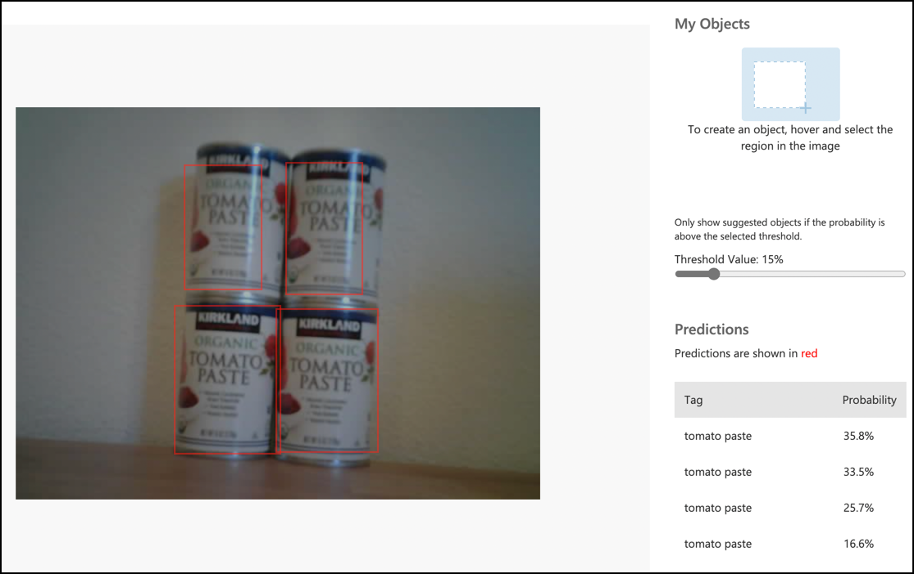

<!--
CO_OP_TRANSLATOR_METADATA:
{
  "original_hash": "1c9e5fa8b7be726c75a97232b1e41c97",
  "translation_date": "2025-08-24T21:07:33+00:00",
  "source_file": "5-retail/lessons/2-check-stock-device/README.md",
  "language_code": "zh"
}
-->
# 从物联网设备检查库存


> 手绘笔记由 [Nitya Narasimhan](https://github.com/nitya) 提供。点击图片查看大图。

## 课前测验

[课前测验](https://black-meadow-040d15503.1.azurestaticapps.net/quiz/39)

## 简介

在上一课中，你学习了对象检测在零售中的不同用途，还学习了如何训练一个对象检测器来识别库存。在本课中，你将学习如何从物联网设备使用对象检测器来统计库存。

本课内容包括：

* [库存统计](../../../../../5-retail/lessons/2-check-stock-device)
* [从物联网设备调用对象检测器](../../../../../5-retail/lessons/2-check-stock-device)
* [边界框](../../../../../5-retail/lessons/2-check-stock-device)
* [重新训练模型](../../../../../5-retail/lessons/2-check-stock-device)
* [统计库存](../../../../../5-retail/lessons/2-check-stock-device)

> 🗑 这是本项目的最后一课，因此在完成本课和作业后，不要忘记清理你的云服务。你需要这些服务来完成作业，所以请确保先完成作业。
>
> 如有需要，请参考[清理项目指南](../../../clean-up.md)获取相关操作说明。

## 库存统计

对象检测器可以用于库存检查，无论是统计库存数量还是确保库存放置在正确的位置。配备摄像头的物联网设备可以部署在商店的各个角落来监控库存，优先从需要频繁补货的热点区域开始，比如存放少量高价值商品的区域。

例如，如果摄像头对准一个可以放置8罐番茄酱的货架，而对象检测器只检测到7罐，那么说明少了一罐，需要补货。


在上图中，对象检测器检测到货架上有7罐番茄酱，而货架最多可以放置8罐。物联网设备不仅可以发送需要补货的通知，还可以提供缺失物品的位置，这对于使用机器人补货的场景尤为重要。

> 💁 根据商店和商品的受欢迎程度，如果只缺少一罐，可能不会立即补货。你需要根据商品、顾客和其他标准设计一个算法来决定何时补货。

✅ 在哪些其他场景中，你可以结合对象检测和机器人技术？

有时货架上可能会出现错误的库存。这可能是补货时的人为错误，或者是顾客改变购买决定后将商品放回了随手可及的地方。如果是非易腐商品（如罐装食品），这只是一个小麻烦。但如果是易腐商品（如冷冻或冷藏食品），可能会导致商品无法再售卖，因为无法确定商品离开冷冻环境的时间。

对象检测可以用来检测意外的物品，并提醒人类或机器人尽快将其归位。


在上图中，一罐婴儿玉米被放在了番茄酱货架上。对象检测器检测到了这一情况，使物联网设备能够通知人类或机器人将这罐玉米归还到正确的位置。

## 从物联网设备调用对象检测器

你在上一课中训练的对象检测器可以从物联网设备调用。

### 任务 - 发布对象检测器的一个迭代版本

可以从 Custom Vision 门户发布迭代版本。

1. 打开 [CustomVision.ai](https://customvision.ai) 并登录（如果尚未打开）。然后打开你的 `stock-detector` 项目。

1. 从顶部选项中选择 **Performance** 标签。

1. 从侧边的 *Iterations* 列表中选择最新的迭代版本。

1. 点击该迭代版本的 **Publish** 按钮。

    

1. 在 *Publish Model* 对话框中，将 *Prediction resource* 设置为你在上一课中创建的 `stock-detector-prediction` 资源。保持名称为 `Iteration2`，然后点击 **Publish** 按钮。

1. 发布后，点击 **Prediction URL** 按钮。这将显示预测 API 的详细信息，你需要这些信息来从物联网设备调用模型。下方标记为 *If you have an image file* 的部分是你需要的详细信息。复制显示的 URL，类似于：

    ```text
    https://<location>.api.cognitive.microsoft.com/customvision/v3.0/Prediction/<id>/detect/iterations/Iteration2/image
    ```

    其中 `<location>` 是你创建 Custom Vision 资源时使用的位置，`<id>` 是由字母和数字组成的长 ID。

    同时复制 *Prediction-Key* 值。这是一个安全密钥，调用模型时必须传递。只有传递此密钥的应用程序才能使用模型，其他应用程序将被拒绝。

    

✅ 当一个新迭代版本发布时，它会有一个不同的名称。你认为如何更改物联网设备使用的迭代版本？

### 任务 - 从物联网设备调用对象检测器

根据以下相关指南，从你的物联网设备使用对象检测器：

* [Arduino - Wio Terminal](wio-terminal-object-detector.md)
* [单板计算机 - Raspberry Pi/虚拟设备](single-board-computer-object-detector.md)

## 边界框

使用对象检测器时，你不仅会获得检测到的对象及其标签和概率，还会获得对象的边界框。这些边界框定义了对象检测器以给定概率检测到对象的位置。

> 💁 边界框是定义包含检测到的对象区域的框，表示对象的边界。

在 Custom Vision 的 **Predictions** 标签中，预测结果会在发送预测的图像上绘制边界框。



在上图中，检测到4罐番茄酱。结果中，每个检测到的对象在图像上都叠加了一个红色方框，表示该对象的边界框。

✅ 打开 Custom Vision 中的预测结果，查看边界框。

边界框由4个值定义：top、left、height 和 width。这些值的范围是0-1，表示相对于图像大小的百分比位置。原点（0,0位置）是图像的左上角，因此 top 值是距离顶部的距离，边界框的底部是 top 加上 height。


上图的宽度为600像素，高度为800像素。边界框从320像素处开始，因此 top 坐标为0.4（800 x 0.4 = 320）。从左侧开始，边界框从240像素处开始，因此 left 坐标为0.4（600 x 0.4 = 240）。边界框的高度为240像素，因此 height 值为0.3（800 x 0.3 = 240）。边界框的宽度为120像素，因此 width 值为0.2（600 x 0.2 = 120）。

| 坐标      | 值    |
| --------- | ----: |
| Top       | 0.4   |
| Left      | 0.4   |
| Height    | 0.3   |
| Width     | 0.2   |

使用0-1的百分比值意味着无论图像被缩放到什么大小，边界框都从0.4的位置开始，并且高度为0.3，宽度为0.2。

你可以结合边界框和概率来评估检测的准确性。例如，对象检测器可能会检测到多个重叠的对象，例如一个罐子在另一个罐子内部。你的代码可以检查边界框，理解这种情况是不可能的，并忽略任何与其他对象有显著重叠的对象。


在上图中，一个边界框表示一个概率为78.3%的番茄酱罐。另一个边界框稍小，位于第一个边界框内，概率为64.3%。你的代码可以检查边界框，发现它们完全重叠，并忽略较低概率的检测，因为一个罐子不可能在另一个罐子内部。

✅ 你能想到哪些情况下检测到一个对象在另一个对象内部是合理的吗？

## 重新训练模型

与图像分类器类似，你可以使用物联网设备捕获的数据重新训练模型。使用这些真实世界的数据可以确保模型在物联网设备上运行良好。

与图像分类器不同的是，你不能仅仅标记一张图像。相反，你需要审查模型检测到的每个边界框。如果边界框围绕的是错误的对象，则需要删除；如果位置不正确，则需要调整。

### 任务 - 重新训练模型

1. 确保你已经使用物联网设备捕获了一系列图像。

1. 在 **Predictions** 标签中，选择一张图像。你会看到红色框表示检测到的对象的边界框。

1. 审查每个边界框。首先选择它，你会看到一个弹出窗口显示标签。使用边界框角上的控制点调整大小（如有必要）。如果标签错误，使用 **X** 按钮删除并添加正确的标签。如果边界框不包含对象，使用垃圾桶按钮删除。

1. 完成后关闭编辑器，图像会从 **Predictions** 标签移动到 **Training Images** 标签。对所有预测重复此过程。

1. 使用 **Train** 按钮重新训练模型。训练完成后，发布迭代版本并更新物联网设备以使用新迭代版本的 URL。

1. 重新部署代码并测试你的物联网设备。

## 统计库存

结合检测到的对象数量和边界框，你可以统计货架上的库存。

### 任务 - 统计库存

根据以下相关指南，使用对象检测器的结果从物联网设备统计库存：

* [Arduino - Wio Terminal](wio-terminal-count-stock.md)
* [单板计算机 - Raspberry Pi/虚拟设备](single-board-computer-count-stock.md)

---

## 🚀 挑战

你能检测到错误的库存吗？训练你的模型识别多种对象，然后更新你的应用程序，当检测到错误的库存时发出警报。

甚至可以更进一步，检测同一货架上的并排库存，定义边界框的限制，查看是否有物品被放错了位置。

## 课后测验

[课后测验](https://black-meadow-040d15503.1.azurestaticapps.net/quiz/40)

## 复习与自学

* 通过 [Microsoft Docs 上的边缘模式缺货检测指南](https://docs.microsoft.com/hybrid/app-solutions/pattern-out-of-stock-at-edge?WT.mc_id=academic-17441-jabenn) 了解如何架构端到端的库存检测系统。
* 观看 [Behind the scenes of a retail solution - Hands On!](https://www.youtube.com/watch?v=m3Pc300x2Mw) 视频，了解如何结合多种物联网和云服务构建端到端的零售解决方案。

## 作业

[在边缘使用你的对象检测器](assignment.md)
